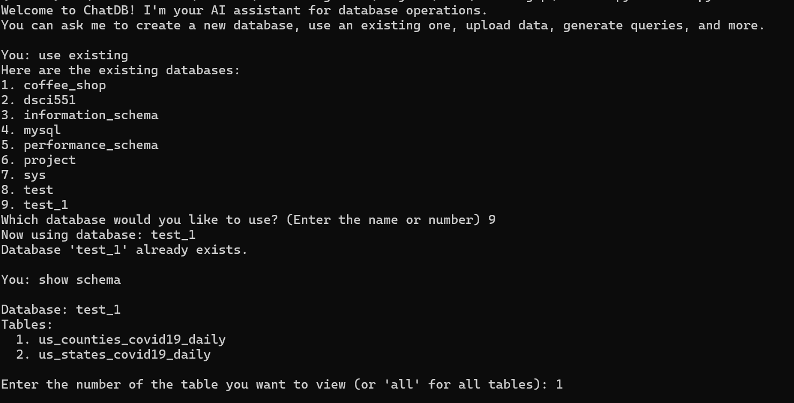
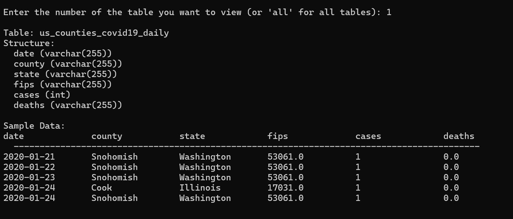
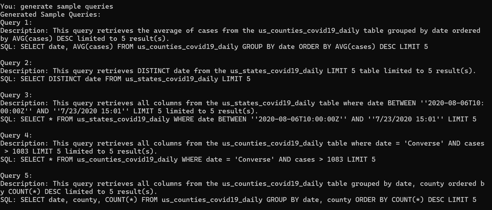
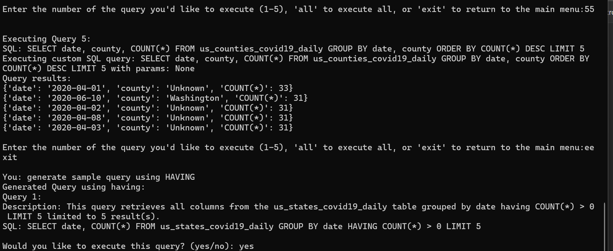
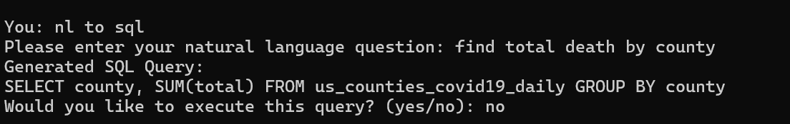

# ChatDB 

Welcome to **ChatDB**, your one-stop platform to learn and master SQL querying like a pro! ChatDB empowers users to explore, generate, and execute SQL queries through a simple and intuitive command-line interface. Say goodbye to the complexities of SQL syntax as ChatDB transforms natural language requests into SQL queries in seconds.

---

## 🚀 **About the Project**
ChatDB is an interactive, user-friendly tool designed to help you understand and execute SQL queries effortlessly. Using pattern-matching techniques and a smart query generation engine, ChatDB bridges the gap between natural language and SQL commands, making database querying accessible to everyone.

### **Key Features**
- 📋 **Natural Language to SQL**: Input natural language queries and watch them transform into SQL statements.
- 📊 **Query Execution**: Run both system-generated and user-defined queries directly on a MySQL database.
- 🔄 **Dynamic Query Generation**: Learn by example as ChatDB provides randomly generated SQL queries with diverse query constructs.
- 📂 **CSV/Excel Upload**: Easily upload datasets in CSV format, and ChatDB will handle parsing and storage in MySQL.
- 🎓 **Interactive CLI**: No need for a web app — everything is accessible directly from your terminal.

---

## 🛠️ **Tech Stack**
- **Programming Language:** Python 🐍
- **Libraries:** Pandas, MySQL Connector/Python, re, csv
- **Database:** MySQL 🗄️

---

## 📜 **How It Works**

### **1️⃣ Natural Language Query to SQL**
ChatDB uses a custom **Pattern Matching Engine** that maps natural language queries to SQL templates. Here's how it works:
- **Input**: "Show total sales by product"
- **Pattern Matching**: The system identifies this as a "total <A> by <B>" pattern.
- **SQL Template Selection**: The system maps it to the SQL template: `SELECT SUM(<A>) FROM <table> GROUP BY <B>`.
- **Dynamic Population**: It finds the appropriate table and columns (like "sales" and "product") to replace `<A>` and `<B>`.

### **2️⃣ Sample Query Generation**
Want to see how SQL queries work? ChatDB generates random SQL queries for you to learn from!
- Randomly selects a query template.
- Dynamically fills in table names, categorical/numerical/date columns to create complete queries.

### **3️⃣ CSV/Excel Data Upload**
- Upload CSV/Excel files to ChatDB.
- Data is automatically parsed and stored in MySQL tables with appropriate column data types.

### **4️⃣ Direct SQL Query Execution**
- Enter your own SQL query directly via the CLI.
- Run and see the output instantly.

---

## File Structure

The project is organized as follows:

### Root Directory
- `screenshots/`: Contains screenshots of the program in action.
- `backend/`: Houses the entire application.

### Backend Directory
- `requirements.txt`: Lists all Python dependencies required for the project.
- `chatdb.py`: Defines the ChatDB class, which manages interactions with the database.
- `utils.py`: Contains all helper backend code, including natural language to SQL conversion, sample query generation, and file parsing functions.
- `cli.py`: Handles all user interactions through the command-line interface.

---

## 🛠️ **Installation**
1. **Clone the repository**
   ```bash
   git clone https://github.com/gayatri-p786/ChatDB-gvp
   cd ChatDB-gvp
   cd backend
   ```
2. **Install required libraries**
   ```bash
   pip install -r requirements.txt
   ```
3. **Set up MySQL Database**
   - Create a MySQL database.
   - Update your database configuration in the `config.py` file.
4. **Run the CLI**
   ```bash
   python cli.py
   ```

---

## 📘 **Usage Instructions**

### **Running ChatDB**
```bash
python cli.py
```
You'll be greeted with an interactive CLI where you can:
- **Upload datasets** using CSV/Excel files.
- **Ask natural language questions** like "Show total revenue by region."
- **Generate random SQL queries** for learning purposes.
- **Run your own SQL queries** directly.

### **Available Commands**
| **Command**                     | **Description**                            |
|---------------------------------|--------------------------------------------|
| `upload data`                   | Upload a CSV/Excel file to MySQL           |
| `nl to sql`                     | Ask a question in natural language         |
| `execute query`                 | Execute a user-defined SQL query           |
| `generate sample query`         | Generate and display a random SQL query    |
| `exit`                          | Exit the ChatDB CLI                        |

---

## 📸 **Screenshots**

**1️⃣ CLI Home Screen**


**2️⃣ Exploring DB**


**3️⃣ Sample Query Generation**


**4️⃣ Sample Query Generation with specific Construct**


**5️⃣ Natural Language Queries**


---

## 💡 **Learning Outcomes**
- **SQL Query Mastery**: Learn by example with ChatDB-generated SQL queries.
- **Hands-on SQL Practice**: Practice SQL directly from the CLI with real-time feedback.
- **Data Handling**: Learn how to work with CSV files and MySQL databases.

---

## 🌟 **Future Enhancements**
1. **Web-based Interface**: Interactive GUI for enhanced user experience.
2. **NoSQL Support**: Add support for MongoDB and other NoSQL databases.
3. **Advanced Query Analytics**: Offer query optimization suggestions and explanations.

---

🌟 **If you find this project helpful, don't forget to give it a star!** 🌟
